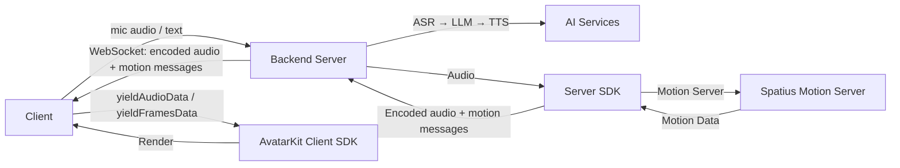

# Backend Mode

[](https://www.npmjs.com/package/@spatius/avatarkit)
[](https://pypi.org/project/spatius/)

## When to use Backend Mode

Backend Mode is for scenarios where **the backend handles the entire conversation pipeline** — ASR, LLM, TTS, and the Server SDK connection to Motion Server. Clients are thin: they capture audio input, send it to the backend via WebSocket, and render the avatar with the returned encoded audio and motion messages.

**Choose Backend Mode when:**
- You want a turnkey server-side pipeline
- You want to keep all API keys and AI logic on the server
- You need to support thin clients (mobile, embedded) that only capture input and render
- You want centralized control over the conversation flow

**Choose [Direct Mode](../direct-mode/) when:**
- You want full client-side control over the conversation pipeline
- You already have your own ASR/LLM/TTS infrastructure
- You want to integrate AvatarKit into an existing app

## Architecture



## Prerequisites

- Python 3.10+, [uv](https://docs.astral.sh/uv/)
- Node.js 18+, pnpm
- [Spatius credentials](https://app.spatius.ai/apps) (App ID + API Key)

## Quick Start

Everything is configured once, on the server. Clients hold no credentials and no
settings: they fetch what they need to boot from `/api/config` and open straight on
the playground.

```bash
# 1. Configure the server
cd servers/python
cp .env.example .env
# Edit .env with your credentials — the server refuses to start until they are filled in

# 2. Start everything
cd ../..
./start.sh
```

The start script will:
- Detect your LAN IP
- Auto-configure Android `local.properties`, iOS `Config.swift` and Flutter
  `lib/config.dart` with the server URL
- Start the server and the React web client

Then open `http://localhost:5180` for the React web client, or open Android Studio /
Xcode and build & run — no manual IP configuration needed.

For mobile-only development (no Web frontend):

```bash
./start.sh --no-frontend
```

## Web Clients

The React, Vue, vanilla, and Next.js clients connect to the server's WebSocket at
`ws://localhost:8765/ws/agent` and fetch the App ID, region, avatar id and sample
rate from `/api/config` on load.

```bash
cd clients/web/react   # or vue/ vanilla/ nextjs-direct/ nextjs-iframe/
cp .env.example .env   # only if the server is not on the same host
pnpm install
pnpm dev
```

| Client | Dev URL |
|---|---|
| `react/` | http://localhost:5180 |
| `vue/` | http://localhost:5181 |
| `vanilla/` | http://localhost:5182 |
| `nextjs-direct/` | http://localhost:3010 |
| `nextjs-iframe/` | http://localhost:3011 |

## Android / iOS / Flutter

The mobile clients connect to the same WebSocket. `start.sh` auto-configures the
server URL in each of them; set it by hand only if you run the server another way —
`BACKEND_MODE_URL` in `clients/android/local.properties`, `backendModeURL` in
`clients/ios/AvatarDemo/Config.swift`, `backendModeURL` in
`clients/flutter/lib/config.dart`.

- **Android**: Open `clients/android/` in Android Studio and run
- **iOS**: Open `clients/ios/AvatarDemo.xcodeproj` in Xcode and run
- **Flutter**: `cd clients/flutter && flutter pub get && flutter run`

## Project Structure

```text
backend-mode/
├── start.sh              # One-command startup
├── clients/
│   ├── web/
│   │   ├── react/
│   │   ├── vue/
│   │   ├── vanilla/
│   │   ├── nextjs-direct/
│   │   └── nextjs-iframe/
│   ├── android/          # Kotlin + Compose
│   ├── ios/              # SwiftUI
│   └── flutter/          # Flutter (iOS + Android)
├── servers/
│   └── python/           # WebSocket server + AI pipeline
└── README.md
```

## References

- [AvatarKit Backend Mode Guide](https://docs.spatius.ai/backend-mode/server-sdk)
- [Get API Keys](https://app.spatius.ai/apps)
- [Test Avatars](https://app.spatius.ai/avatars/library)
- [Regions & Endpoints](https://docs.spatius.ai/api-reference/regions)
