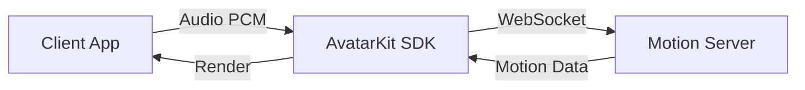

# Direct Mode

[](https://www.npmjs.com/package/@spatius/avatarkit)

## When to use Direct Mode

Direct Mode is for scenarios where **the client drives the avatar directly** — your app sends audio data to Spatius Motion Server, which returns motion data for lip-synced avatar rendering. The entire conversation pipeline (ASR, LLM, TTS) is your responsibility to implement wherever you prefer (client-side, your own backend, or a third-party service).

**Choose Direct Mode when:**
- You want full control over the conversation pipeline
- You already have your own ASR/LLM/TTS infrastructure
- You want to integrate AvatarKit into an existing app

**Choose [Backend Mode](../backend-mode/) when:**
- You want a turnkey server-side pipeline (backend handles ASR → LLM → TTS → Avatar)
- You want to keep API keys and AI logic on the server
- You need to support thin clients that only render

## Architecture



## About the audio in these demos

Every client here ships a handful of `.pcm` files and sends them when you tap a
clip. **That is a convenience, not the shape of the API.** `send()` accepts any
PCM16 audio at the configured sample rate, so the exact same call works for:

- live microphone capture, chunked as it arrives
- a TTS service streaming audio back to you
- audio from your own pipeline, wherever it runs

The demos bundle files so they run with nothing but an App ID and a Session
Token — no ASR/LLM/TTS keys, no backend. Swap the byte source and the rest of
the integration is unchanged.

```
any PCM16 source  ─┐
  microphone       │
  TTS stream       ├─►  controller.send(chunk, end)  ─►  Motion Server  ─►  avatar
  bundled file     │
  your pipeline   ─┘
```

## Prerequisites

- [Spatius credentials](https://app.spatius.ai/apps) (App ID + Session Token)

## Token servers

Direct Mode clients connect to Motion Server directly, but they must not hold `SPATIUS_API_KEY`. Use a small backend endpoint to exchange your server-side API Key for a short-lived Session Token, then pass that Session Token to the client.

The examples in `servers/python`, `servers/nodejs`, and `servers/go` are token servers only. They do not run ASR, LLM, or TTS; they do not connect to Motion Server; and they do not transport audio or motion data. For that runtime-server architecture, use [Backend Mode](../backend-mode/).

## Quick Start

### Web

The server holds the API Key and mints Session Tokens, so it starts first:

```bash
cd servers/python
cp .env.example .env    # fill SPATIUS_API_KEY and SPATIUS_APP_ID
uv run app.py
```

Then the client, in a second terminal:

```bash
cd clients/web/reference/react
pnpm install
pnpm dev
```

Open `http://localhost:5173` and pick a scene on the configuration page.

**Sample audio** streams a bundled PCM clip and needs nothing beyond the two Spatius
values. **Realtime conversation** captures the microphone and runs a voice agent on the
server, so it also needs the LiveKit section of `.env` — LiveKit is used for Inference
only, not for a room, so no OpenAI or Deepgram account of your own is required.

Anything left blank in `.env` can be filled in on the configuration page instead, which
is what makes the demo usable from a phone on the same network.

The same client is provided for other frameworks under `clients/web/reference/`:
`vue/`, `vanilla/`, `nextjs-direct/`, and `nextjs-iframe/`.

### Android

Open `clients/android/` in Android Studio. Enter App ID and Session Token on the config screen, select a character, and tap an audio file.

### iOS

```bash
cd clients/ios
xcodegen generate
```

Open `AvatarDemo.xcodeproj` in Xcode. Enter App ID and Session Token, select a character, and tap an audio file.

## Project Structure

```text
direct-mode/
├── clients/
│   ├── web/
│   │   ├── shared/       # backend calls + SDK lifecycle the clients share
│   │   └── reference/
│   │       ├── react/
│   │       ├── vue/
│   │       ├── vanilla/
│   │       ├── nextjs-direct/
│   │       └── nextjs-iframe/
│   ├── android/          # Kotlin + Compose
│   ├── ios/              # SwiftUI
│   └── flutter/          # Flutter (iOS + Android)
├── servers/              # Optional local session-token servers
│   ├── python/
│   ├── nodejs/
│   └── go/
└── README.md
```

## Extending with Real-Time Conversation

The **Realtime conversation** scene shows the shape of it: the browser captures
microphone PCM, [`servers/python/realtime.py`](./servers/python/realtime.py) runs ASR,
LLM and TTS, and the assistant PCM comes back over the same WebSocket. There is no
LiveKit room in that path — the browser hands the reply to `controller.send()` and
keeps the Motion Server connection itself, which is what makes it Direct Mode.

For production, keep long-lived provider keys on your backend and mint short-lived
browser tokens, as the server here does for the Session Token.

## References

- [AvatarKit Direct Mode Guide](https://docs.spatius.ai/direct-mode/client)
- [Get API Keys](https://app.spatius.ai/apps)
- [Test Avatars](https://app.spatius.ai/avatars/library)
- [Session Token Guide](https://docs.spatius.ai/api-reference/auth)
