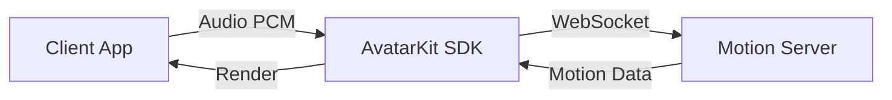

# Direct Mode

[](https://www.npmjs.com/package/@spatius/avatarkit)

## When to use Direct Mode

Direct Mode is for scenarios where **the client drives the avatar directly** — your app sends audio data to Spatius Motion Server, which returns motion data for lip-synced avatar rendering. The entire conversation pipeline (ASR, LLM, TTS) is your responsibility to implement wherever you prefer (client-side, your own backend, or a third-party service).

**Choose Direct Mode when:**
- You want full control over the conversation pipeline
- You already have your own ASR/LLM/TTS infrastructure
- You want to integrate AvatarKit into an existing app

**Choose [Backend Mode](../backend-mode/) when:**
- You want a turnkey server-side pipeline (backend handles ASR → LLM → TTS → Avatar)
- You want to keep API keys and AI logic on the server
- You need to support thin clients that only render

## Architecture



## About the audio in these demos

Every client here captures the microphone and sends the PCM to `servers/python`,
which runs ASR → LLM → TTS and streams the assistant's reply back as PCM. The client
hands that reply to `controller.send()` and keeps the Motion Server connection
itself — which is what makes it Direct Mode. There is no LiveKit room in the path.

```
  mic PCM16  ──ws──►  server (ASR → LLM → TTS)  ──ws──►  assistant PCM16
                                                              │
                                                              ▼
                                                    controller.send(chunk, end)
                                                              │
                                                              ▼
                                                    Motion Server  ─►  avatar
```

**The microphone is one source, not the shape of the API.** `send()` accepts any
PCM16 audio at the configured sample rate, so the same call works for:

- live microphone capture, chunked as it arrives
- a TTS service streaming audio back to you
- a file you read off disk
- audio from your own pipeline, wherever it runs

Swap the byte source and the rest of the integration is unchanged.

## Prerequisites

- [Spatius credentials](https://app.spatius.ai/apps) (App ID + API Key)
- [LiveKit credentials](https://cloud.livekit.io) — the server runs the conversation
  through LiveKit Inference, so no OpenAI or Deepgram account of your own is required

## The server

Direct Mode clients connect to Motion Server directly, but they must never hold
`SPATIUS_API_KEY`. The example in `servers/python` exchanges that server-side key for
a short-lived Session Token, and it also runs the conversation: ASR, LLM and TTS,
returning plain PCM. It never touches motion data — that stays between the client and
Motion Server.

**All configuration lives in the server's `.env`** — credentials, region, avatar,
conversation language, models and voice. The clients hold none of it: each one boots
by fetching `GET /api/config` and minting a token. There is no configuration screen
on any client, and nothing to type into a phone.

## Quick Start

The server holds the API Key and mints Session Tokens, so it starts first:

```bash
cd servers/python
cp .env.example .env    # fill SPATIUS_API_KEY, SPATIUS_APP_ID and the LiveKit keys
uv sync
uv run app.py
```

It refuses to start while a required key is empty, naming the ones that are. Two
listeners come up — `http://0.0.0.0:8090` and `ws://0.0.0.0:8091/ws/realtime` — and
the LAN address is printed at startup, which is the one to use from a phone.

### Web

```bash
cd clients/web/reference/react
pnpm install
pnpm dev
```

Open `http://localhost:5173`. It opens straight on the playground: pick a character,
press **Start**, then tap the microphone and talk.

The client finds the server at the page's own host on port 8090. When the server is
elsewhere, set `VITE_DIRECT_MODE_URL` (or `NEXT_PUBLIC_DIRECT_MODE_URL` for the
Next.js clients) — see each client's `.env.example`.

The same client is provided for other frameworks under `clients/web/reference/`:
`vue/`, `vanilla/`, `nextjs-direct/`, and `nextjs-iframe/`.

### Android

Open `clients/android/` in Android Studio. Copy `local.properties.example` to
`local.properties` and point `DIRECT_MODE_URL` at the running server — the emulator
reaches the host machine at `http://10.0.2.2:8090`, a physical device needs the LAN
address the server printed. Run the app; it boots straight into the playground.

### iOS

```bash
cd clients/ios
xcodegen generate
```

Open `AvatarDemo.xcodeproj` in Xcode. Set `directModeURL` in `AvatarDemo/Config.swift`
to the running server — the simulator shares the Mac's network, so the default works
there; a device needs the LAN address. Run the app.

### Flutter

```bash
cd clients/flutter
flutter pub get
flutter run
```

Set `directModeUrl` in `lib/config.dart` to the running server. The Android emulator
reaches the host at `http://10.0.2.2:8090`; the iOS simulator shares the Mac's
network, so the default works there.

## Project Structure

```text
direct-mode/
├── clients/
│   ├── web/
│   │   ├── shared/       # backend calls the clients share
│   │   └── reference/
│   │       ├── react/
│   │       ├── vue/
│   │       ├── vanilla/
│   │       ├── nextjs-direct/
│   │       └── nextjs-iframe/
│   ├── android/          # Kotlin + Compose
│   ├── ios/              # SwiftUI
│   └── flutter/          # Flutter (iOS + Android)
├── servers/
│   └── python/           # session tokens + the voice agent
└── README.md
```

## Taking it to production

The conversation pipeline here is an example, not a requirement: Direct Mode only
cares that PCM reaches `controller.send()`. Replace `servers/python/realtime.py` with
your own ASR/LLM/TTS, or drop the socket entirely and feed the SDK from a TTS service
you already run.

Keep long-lived provider keys on your backend and mint short-lived client tokens, as
the server here does for the Session Token. The demo server has no authentication —
add it before putting anything on a public network.

## References

- [AvatarKit Direct Mode Guide](https://docs.spatius.ai/direct-mode/client)
- [Get API Keys](https://app.spatius.ai/apps)
- [Test Avatars](https://app.spatius.ai/avatars/library)
- [Session Token Guide](https://docs.spatius.ai/api-reference/auth)
